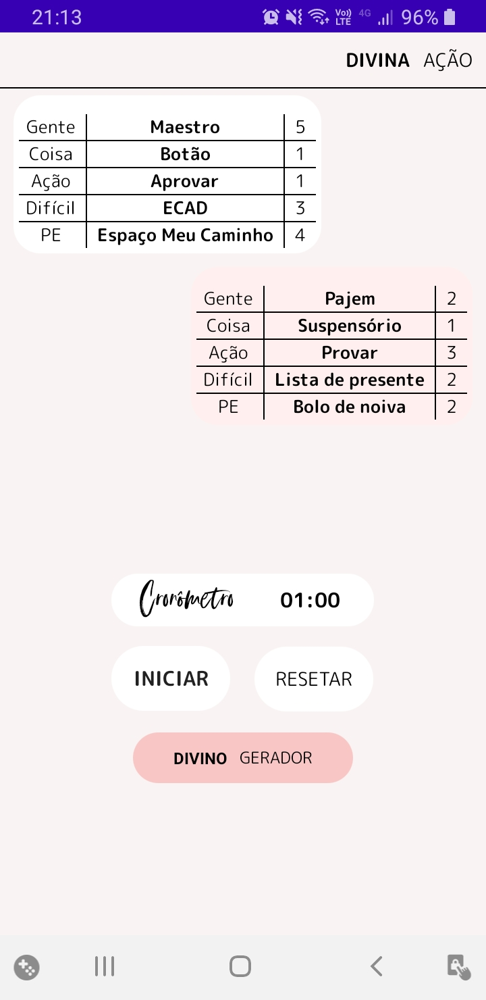

# SantoGame
SantoGame was developed in Java and its purpose is only to generate words in two different tables.

**Features** 
- Countdown timer
- Constraint Layout
- Table Layout
- Table Row.

The ***Countdown timer*** can be paused or reset.

When ***reset*** button is pressed the ***Countdown timer*** and the tables are reset at the same time.

The app can be seen below

